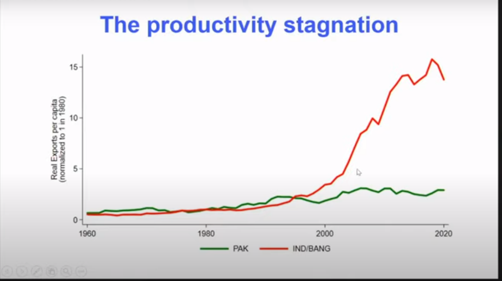
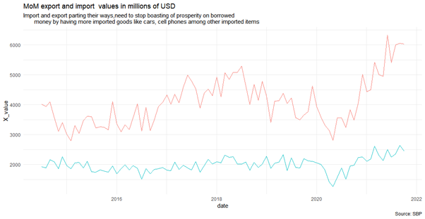
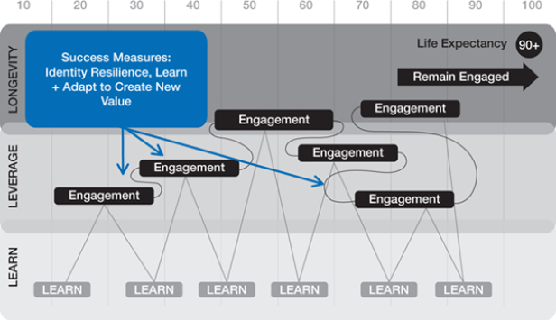
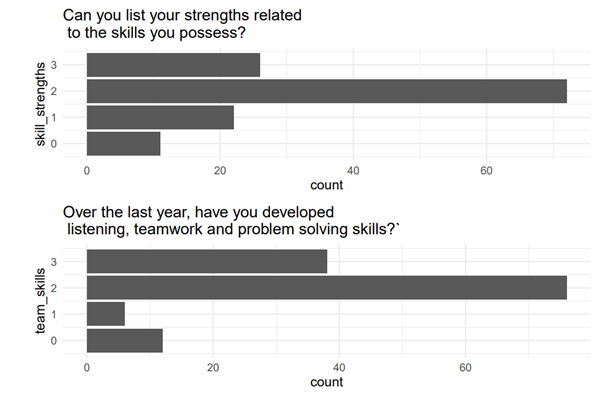

```{r setup, include=FALSE}
knitr::opts_chunk$set(
  fig.width=9, fig.height=4, fig.retina=2, 
  out.width="100%",
  message = FALSE
)
```


```{r xaringanthemer, echo=FALSE}
library(xaringanthemer)
style_duo_accent(
  primary_color = "#035AA6",
  secondary_color = "#03A696",
  colors = c(yellow = "#FFFC31", pink = "#E56399",orange= "#fb5607",
 blue_violet   = "#8338ec",
 zomp          = "#38A88E",
 shadow        = "#87826E",
 blue          = "#1381B0",
 yellow_orange = "#FF961C")
)
```

```{r qau-logo, echo=FALSE}
xaringanExtra::use_logo(
  image_url = "IBA.png"
)
```

---
class: center inverse title-slide
background-image: url(iba.jpg)
background-position:  100% 100%
background-size:  contain
# 2nd Annual Conference : CBER, IBA
 
## Challenges for future universities and future jobs
### Zahid Asghar, Quaid-i-Azam University, Islamabad

---

class: top left inverse title-slide hide_logo 
background-image: url(cber.png)
background-position: 100% 0%
background-size: 40% 

## Introduction 

### stangnant export, stagnant productivity
### Future Job Challenges : AI, ML, Robotics
### Survey results
### Learning Ecosystem
> Thinking from forced feed or factory model to new higher education system

### Industria era vs digital era higher education system

### Way-forward

---

class: top left  hide_logo 
background-image: url(cber.png)
background-position: 100% 0%
background-size: 40% 


# .orange[ Productivity and Trade Gap] 
.pull-left[

]

.pull-right[
]

---
class: top left  


---

---


---


---
class: top left  hide_logo 
background-image: url(cber.png)
background-position: 100% 0%
background-size: 40%


# Skill-gap

> ##   .pink[Gone are the days of a straight-line path through college to work to promotion to career to retirement.]

.pull-left[
## Upskilling  
### .pink[Upskilling is deepening your knowledge and skills in your current domain.]  

]

--
.pull-right[
## Reskilling
### .pink[Reskilling is extending your knowledge and skills to new domains.]
]
---
.pull-left[
### Single does of education

] <!--end of pull left-->

.pull-right[
### Leap from Old to New Reality

] <!--end of pull right-->

---

class: top left  hide_logo 
background-image: url(cber.png)
background-position: 100% 0%
background-size: 30%

    
.pull-left[
### Old to New Reality

] <!--end of pull left-->

.pull-right[
### Rotuine vs Nonroutine

] <!--end of pull right--> 

---
class: left middle  hide_logo 
background-image: url(cber.png)
background-position: 80% 0%
background-size: 40%

> # .big[“The ability to learn faster than your competitors may be the only sustainable competitive advantage.”] 

.footnote[Peter Senge, ‘The Fifth Discipline’]

---

class: top left
background-image: url(jobs.jpg)
background-size: cover

# ABL : Always Be Learning.

<span role="img" aria-label="Preparing for jobs which not exist yet"></span> 

---

```{r echo=FALSE, message=FALSE, warning=FALSE}
library(tidyverse)
library(readr)
library(gridExtra)
Career_survey <- read_csv("career_survey.csv")
Career_survey <- read_csv("career_survey.csv")
career<-Career_survey %>% rename(time=Timestamp,name=`Name (Optional)`,email=`Email (Optional)`,program=`Program of study`, subject= `Name of the degree Program (e.g BBA/BS Sociology/...)`, career_entry=`How do you feel about career planning?`, tech_challenges=`Do you think that Artificial Intelligence, Machine Learning, Robotics and Other automation are serious threats to your job prospects in 5 to 10 years times.`, notfamily_career=`Have you learned about different careers other than those of your family careers?`, job_info=`Do you know how to find information about jobs and careers?`
, future_job=`Have you thought about how jobs and careers may change in the future?`,job_options=`Do you understand the options you have for education and work after you leave university?`)
```

```{r rename-variables, echo=FALSE, message=FALSE, warning=FALSE}
career<-career %>% rename(
  cv_creation=`Do you feel you can create a CV?`,skill_strengths=`Can you list your strengths related to the skills you possess?`,future_plan= `Do you have ideas about what you might do in the future?`,skill_job_match=`Do you have ideas about which careers match your interests and skills?`
,career_interest=`Do you know yet what career areas you are interested in?`, group_talk=`Are you comfortable speaking in front of a group of people?`,team_skills= `Over the last year, have you developed listening, teamwork and problem solving skills?`,comm_skills=`How would you rate your strength in the following career skills? [Communcation skill]`,writing_skills=`How would you rate your strength in the following career skills? [Communicating in writing]`,working_data_numbers=`How would you rate your strength in the following career skills? [Working with data and numbers]`,working_with_people=`How would you rate your strength in the following career skills? [Working with people]`, dressing_properly=`How would you rate your strength in the following career skills? [Dressing appropriately for a workplace]`,punctuality=`How would you rate your strength in the following career skills? [Being on time for work or meetings]`, attendance=`How would you rate your strength in the following career skills? [Having good attendance]`,workplace_safety=`How would you rate your strength in the following career skills? [Understanding workplace safety rules]`,motivation_and_initiative=`How would you rate your strength in the following career skills? [Being motinated and taking initiative]`,other_comments=`Anything you want to say about future career challenges and opportunities or related feedback`)

```

```{r echo=FALSE, message=FALSE, warning=FALSE}
#career1<-career %>% mutate_at(c("tech_challenges","notfamily_career","job_info","future_job","job_options","skill_strengths","cv_creation","group_talk","future_plan","skill_job_match","team_skills"), funs(recode(.,`No, not yet`=1, `No , not yet`=1, `Probably, I'm not sure`=2, `Yes to some extent`=3,`Yes to a great extent`=4,.default = NaN)))
#career %>% select(comm_skills) %>% group_by(comm_skills) %>% 
#  summarise(n=n()) %>% 
#  mutate(freq = n*100 / sum(n))
library(stringr)
c1<-career %>% select(comm_skills) %>% ggplot(aes(x=comm_skills))+geom_bar()+labs(title = "How would you rate your strength \n in the following career skills?")+theme_minimal()+coord_flip()

```

```{r echo=FALSE}
c2<-career %>% select(career_entry) %>% 
  ggplot(aes(x=career_entry))+geom_bar(position = 'dodge')+labs(title = "How do you feel about career  planning?")+theme_minimal()+coord_flip()
gA1 <- ggplotGrob(c1)
 gB1 <- ggplotGrob(c2)
 maxWidth = grid::unit.pmax(gA1$widths[2:5], gB1$widths[2:5])
 gA1$widths[2:5] <- as.list(maxWidth)
 gB1$widths[2:5] <- as.list(maxWidth)

```

```{r echo=FALSE, warning=FALSE}
c3<- career %>% select(group_talk) %>% ggplot(aes(x=group_talk))+geom_bar(position = 'dodge')+labs(title = "How do you feel about career planning?")+theme_minimal()+coord_flip()


```

--- 
## Skill Strength

```{r echo=FALSE, warning=FALSE}
c4<-career %>% select(skill_strengths) %>% ggplot(aes(x=skill_strengths))+geom_bar(position = 'dodge')+labs(title = "Can you list your strengths related \n to the skills you possess?")+theme_minimal()+coord_flip()

```

--- 

```{r echo=FALSE, warning=FALSE}

c5<-career %>% select(team_skills) %>% ggplot(aes(x=team_skills))+geom_bar(position = 'dodge')+labs(title = "Over the last year, have you developed \n listening, teamwork and problem solving skills?`")+theme_minimal()+coord_flip()
gA11 <- ggplotGrob(c3)
 gB11 <- ggplotGrob(c4)
 gC11<-ggplotGrob(c5)
 maxWidth = grid::unit.pmax(gA11$widths[2:5], gB11$widths[2:5],gC11$widths[2:5])
 gA11$widths[2:5] <- as.list(maxWidth)
 gB11$widths[2:5] <- as.list(maxWidth)
 gC11$widths[2:5] <- as.list(maxWidth)
 grid.arrange(gA1, gB1, ncol=1)

grid.arrange(gB11,gC11, ncol=1)
```

---
##  Skills Learning


```{r, echo=FALSE, warning=FALSE,message=FALSE}
#c5
```


```{r echo=FALSE, warning=FALSE}
comm_skills_tble<-career %>% select(comm_skills) %>% group_by(comm_skills) %>% 
  summarise(n=n()) 
writing_skills_tbl<-career %>% select(writing_skills) %>%group_by(writing_skills) %>%  summarise(n=n())
working_data_numbers_tbl<-career %>% select(working_data_numbers) %>% group_by(working_data_numbers) %>% summarise(n=n())
punctuality_tbl<-career %>% select(punctuality) %>%group_by(punctuality) %>%  summarise(n=n())
working_with_people_tbl<-career %>% select(working_with_people) %>% group_by(working_with_people) %>% summarise(n=n())
attendance_tbl<-career %>% select(attendance) %>% group_by(attendance) %>% summarise(n=n())
dressing_tbl<-career %>% select(dressing_properly) %>% group_by(dressing_properly)%>% summarise(n=n())

motivation_tbl<-career %>% select(motivation_and_initiative) %>%group_by(motivation_and_initiative) %>%  summarise(n=n())
dta <- qpcR:::cbind.na(punctuality_tbl,writing_skills_tbl,motivation_tbl,attendance_tbl,dressing_tbl,motivation_tbl,working_data_numbers_tbl,working_with_people_tbl)

cat_summary<-read.csv("dta_summary.csv")
```

---
## Smart vs hardwork

```{r echo=FALSE, message=FALSE, warning=FALSE}

#cat_summary  %>% 
#ggplot(aes(x=Categories, y=Value))+geom_bar()+labs(title = "Over the last year, have you developed listening, teamwork and problem solving skills?`")

p1<-cat_summary %>% filter(Categories=="Very_strong" ) %>% 
  ggplot(aes(Variable, Value, fill = Categories)) +
  geom_bar(position = "dodge", stat = "identity") +
  theme_bw()+labs(title = " **Very_Strong** skills")+coord_flip()
p2<-cat_summary %>% filter(Categories=="In-between" ) %>% 
  ggplot(aes(Variable, Value, fill = Categories)) +
  geom_bar(position = "dodge", stat = "identity") +
  theme_bw()+labs(title=" **In-between** skills")+coord_flip()
library(gridExtra)

gA <- ggplotGrob(p1)
 gB <- ggplotGrob(p2)
 maxWidth = grid::unit.pmax(gA$widths[2:5], gB$widths[2:5])
 gA$widths[2:5] <- as.list(maxWidth)
 gB$widths[2:5] <- as.list(maxWidth)
 grid.arrange(gA, gB, ncol=1)

```

---
## Career counseling
### Do you think choice of degree would have been better if you were provided career counseling before admission to a university?

| Response | %age  |
|----------|-------|
| Yes      | 68.8% |
| No       | 13.4% |
| Maybe    | 17.9% |

---
### Do you think career counseling be mandatory?
| Response          | % response |
|-------------------|-------------|
| Strongly agree    | 67.5%       |
|                   |             |
| Agree             | 26.3%       |
|                   |             |
| Nuetral           | 5.5%        |
|                   |             |
| Disagree          | 0.7%        |
|                   |             |
| Strongly Disagree | 0%          |

---

## Average earnings per month in USD by qualification

| Qualification | Earnings (USD) |
|---------------|----------------|
| Matric        | 165.54         |
| Intermediate  | 156.76         |
| Bachelor      | 198.94         |
| Masters       | 117.54         |
| PhDs          | 350.00         |

---

## Future Universities

### Insufficient work: very slow process and remains out of reach
### Youth fate: Parents background, region of residence
### College and Universities: Only for few and previlidged
### Govt and educational leaders dont think to make education inclusive
### Excellence through narrowness, small numbers, big classes not any good , expansion not good 
### Equity and fairness are not in picture 

---
class: 

### Present universities model built on exclusivity 
### Cost can not be reduced unless we scale higher education
### Main question: How to drive human capital to scale

Talent uninspiredm, talent uneducated
90 million youth , how it can have access to education 24/7 


---

## In/Out Flexible System 
wave pattern: enter, exit, stay away, enter, exit....

<i class="fa-regular fa-file-waveform"></i>


