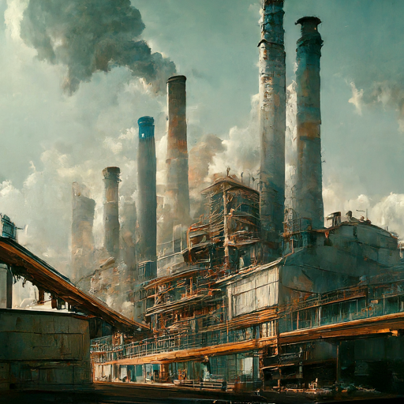
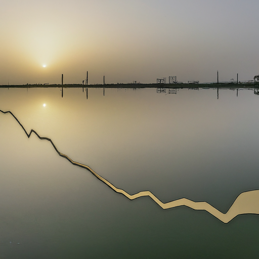
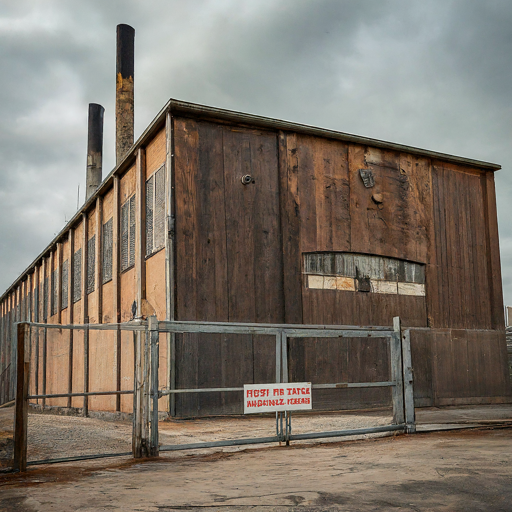

# Part I: Structure & Composition {background-color="#0a1f12"}

## The Industrial Sector of Pakistan

{.center width="70%"}

::: {.text-muted .center}
Overview of the industrial sector's importance in Pakistan's economy — its contribution to GDP, employment, and exports
:::

## Why Industry Matters

::: highlight-box
Industry is the **engine of structural transformation** — no country has achieved sustained middle-income status without a strong manufacturing base.
:::

::::::: kpi-row
::: stat-box
[\~20%]{.stat-value} [Industry Share of GDP (2024)]{.stat-label}
:::

::: stat-box
[19%]{.stat-value} [Manufacturing Sub-Sector]{.stat-label}
:::

::: stat-box
[5.75%]{.stat-value} [LSM Growth Jul–Jan 2025–26]{.stat-label}
:::

::: stat-box
[\~25%]{.stat-value} [Industrial Employment]{.stat-label}
:::
:::::::

[Sources: PBS 2026, Trading Economics, World Bank 2024]{.text-muted}

## Sectoral Composition of GDP (2024)

{.center width="55%"}

:::::: columns-3
::: stat-box
[53%]{.stat-value} [Services]{.stat-label}
:::

::: stat-box
[25%]{.stat-value} [Industry]{.stat-label}
:::

::: stat-box
[22%]{.stat-value} [Agriculture & Livestock]{.stat-label}
:::
::::::

::: fragment
### Within Industry:

-   **Manufacturing** — 19% of GDP (textiles, food, cement, pharma, auto)
-   **Mining & Quarrying** — \~3% of GDP (coal, natural gas, salt, marble, chromite)
-   **Construction** — \~2.5% of GDP (housing, infrastructure, CPEC projects)
-   **Utilities** — electricity, gas, and water supply
:::

::: {.fragment .highlight-box}
**The Paradox:** Industry's GDP share has *declined* from \~24% in 2005 to \~20% in 2024 — Pakistan is **deindustrialising** before industrialising.
:::

## Major Industries at a Glance

| Industry | Export Share | Key Products | Status |
|-----------------|:-----------------:|---------------------|:---------------:|
| **Textiles & Garments** | \~60% | Yarn, fabric, knitwear, bedwear | [Stagnating]{.amber} |
| **Cement** | Domestic + export | OPC, blended cement | [Moderate]{.green} |
| **Food Processing** | Growing | Dairy, rice, halal meat | [Potential]{.blue} |
| **Pharmaceuticals** | \~\$300M | Generics, biosimilars | [Emerging]{.green} |
| **Automobiles** | Minimal | CKD assembly, 2/3-wheelers | [Protected]{.red} |
| **IT & Software** | \~\$3.2B | Freelancing, BPO, SaaS | [Rising]{.green} |
| **Surgical Instruments** | \~\$500M | Sialkot cluster | [Niche]{.amber} |

[Source: PBS, SBP, TDAP — FY2024–25 estimates]{.text-muted}

## The Textile Dominance Problem

::::: columns-2

### Over-Reliance on One Sector

-   Textiles account for **\~60% of merchandise exports**
-   Concentrated in **low-value segments** — yarn, grey cloth, basic garments
-   Pakistan's unit price for garments is **30–40% below** Bangladesh and Vietnam
-   Limited **value addition** — most exports are at the commodity end
-   **Female labour force participation** at just \~24% constrains garment scaling

### Comparison: Textile Export Sophistication

| Country      | Unit Value (\$/kg) |     Value Chain     |
|--------------|:------------------:|:-------------------:|
| Vietnam      |      \$18–22       |    Full package     |
| Bangladesh   |      \$14–17       |    Mid-value RMG    |
| **Pakistan** |     **\$8–12**     | **Basic/commodity** |
| Turkey       |      \$20–25       |   Fashion + brand   |

[Pakistan's garment exports are stuck in the lowest tier of the value chain]{.text-muted}

:::::

::: {.fragment .highlight-box}
**Key Insight:** Bangladesh's garment exports grew from **\$6B to \$55B** (2000–2024). Pakistan's merchandise exports grew from **\$9B to \~\$32B** over the same period.
:::

------------------------------------------------------------------------

# Part II: Historical Evolution {background-color="#0a1f12"}

## Pakistan's Industrial Timeline

::::: columns-2

### Phase 1: Import Substitution (1947–1970s)

-   **Post-Partition:** Almost no industrial base — Muslim majority areas were agricultural
-   **1950s–60s:** Ayub Khan era — heavy industrialisation drive
    -   Pakistan Industrial Development Corporation (PIDC)
    -   Steel Mills, fertiliser plants, heavy machinery
    -   **"22 Families"** — concentration of industrial wealth
-   **1970s:** Bhutto nationalisation — cotton ginning, rice husking, flour milling, vegetable ghee, cement
    -   **Result:** Destroyed entrepreneurial class, created PSE burden that persists today

### Phase 2: Liberalisation & Stagnation (1980s–2020s)

-   **1980s:** Zia-era deregulation — private sector re-entry, some growth in textiles
-   **1990s:** Structural adjustment, privatisation attempts (PTCL, Muslim Commercial Bank)
-   **2000s:** Musharraf-era consumption boom — telecom, banking, real estate; **not manufacturing**
-   **2010s:** Energy crisis devastates industry — circular debt chokes manufacturing
-   **CPEC (2015+):** Infrastructure-focused; **minimal industrial cooperation** or technology transfer
-   **2020s:** COVID disruption → commodity shock → IMF austerity → demand destruction

:::::

## The Decline of Industrial Share

::::::: columns-2

{width="100%"}

[Source: Our World in Data / World Bank WDI 2026]{.text-muted}

::: highlight-box
**A sobering trend:** Pakistan's industrial share of GDP peaked at \~24% in 2005 and has since declined to \~20% in 2024. Manufacturing value added fell to **13.1%** in 2024. This is the **opposite** of East Asian structural transformation.
:::

::: stat-box
[24% → 20%]{.stat-value} [Industry GDP Share: 2005 → 2024]{.stat-label}
:::

:::::::

::: fragment
### Why Deindustrialisation?

1.  **Energy costs** — industrial electricity tariffs at PKR 34–46/kWh (vs. PKR 8–12 in Bangladesh, Vietnam)
2.  **Anti-export bias** — high import tariffs on inputs make finished goods uncompetitive
3.  **Real estate diversion** — investible surplus flows to speculative land, not productive capital
4.  **No technology transfer** — R&D spending at \~0.2% of GDP (India: 0.7%, S. Korea: 4.9%)
5.  **Policy discontinuity** — average Finance Minister tenure under 18 months
:::

::: fragment
> *"Manufacturing-led growth is the only historically validated pathway for middle-income transition at Pakistan's stage of development."* — World Bank Pakistan Development Update
:::

------------------------------------------------------------------------

# Part III: Critical Challenges {background-color="#0a1f12"}

##  {background-color="#0a1f12"}

{.center width="70%"}

::: center
### [Critical Challenges Facing Pakistan's Industrial Sector]{.gold}
:::

## The Energy Crisis — Industry's Biggest Burden

::::::: kpi-row
::: stat-box
[PKR 2.6T]{.stat-value} [Circular Debt Stock (FY2025)]{.stat-label}
:::

::: stat-box
[\~45,000 MW]{.stat-value} [Installed Capacity]{.stat-label}
:::

::: stat-box
[33.9%]{.stat-value} [Utilisation Factor]{.stat-label}
:::

::: stat-box
[3×]{.stat-value} [Tariff Increase Since 2015]{.stat-label}
:::
:::::::

::: fragment
### How Circular Debt Kills Industry

-   Effective electricity tariff has risen from **PKR 12.5/kWh (2015)** to **PKR 34.5/kWh (2025)**
-   Capacity payments to IPPs reached **PKR \~2.1 trillion** in FY2024
-   T&D losses remain at **16–17%** across state-owned DISCOs
-   Industries choosing **captive power** or relocating production to Bangladesh/Vietnam
-   **Roshan Maeeshat Bijli Package** (Nov 2025): reduced industrial tariff to PKR 22.98/kWh — but temporary
:::

[Sources: NEPRA State of Industry Report, IMF Country Report 25/109, PIDE 2025]{.text-muted}

## Export Stagnation — The Core Failure

::::: columns-2

### Pakistan's Export Trajectory

-   **FY2025–26 (Jul–Feb):** Merchandise exports at **\$20.5B** — down 7.3% YoY
-   Total goods + services projected at **\$40–41B** for FY2025–26
-   Exports-to-GDP ratio: **\~10%** — lowest in the region
-   Textile concentration **\>60%** with minimal diversification
-   Government's **\$100B by 2030** target: "aspirational rather than credible"

{width="90%"}

[Source: TheGlobalEconomy.com / World Bank]{.text-muted}

### Regional Export Comparison (2024)

| Country      | Exports/GDP |
|--------------|:-----------:|
| Vietnam      |   **87%**   |
| Malaysia     |   **70%**   |
| India        |   **22%**   |
| Bangladesh   |   **15%**   |
| **Pakistan** |  **\~10%**  |

[Pakistan has the lowest export-to-GDP ratio among all regional peers]{.text-muted}

:::::

::: {.fragment .highlight-box}
**The Anti-Export Bias:** A product priced at \$100 globally, after 20% import tariff, sells for \$120 domestically. Exporters find it more profitable to serve the captive domestic market — destroying competitiveness.
:::

## The Four Structural Distortions

::::: columns-2

### 1. Anti-Export Bias

-   High import tariffs incentivise domestic sales over exports
-   Import duties rose from **15% (FY2010) to 21.3% (FY2020)**
-   Consumers pay inflated prices; producers have no incentive to export
-   **Result:** Exports stagnant for a decade

### 2. Import Substitution Dependency

-   Protected industries are non-competitive globally
-   Permanent burden on foreign exchange — importing inputs for domestic-only production
-   Low-quality goods for captive market

### 3. Market-Seeking FDI

-   Foreign companies invest to **sell locally**, not to export
-   No integration into global value chains
-   Limited technology transfer or skill spillovers
-   **Example:** Auto assemblers with 30+ years and still no export capability

### 4. Policy Capture

-   Industrial elites influence policy for private benefit
-   Tariff protection, SROs, subsidies benefit incumbents
-   Entry barriers prevent new competition
-   **Result:** Rent-seeking over innovation

:::::

## The Taxation Trap

::: highlight-box
Pakistan's tax-to-GDP ratio is **\~10%** — among the lowest globally. Yet the burden falls **crushingly** on those already in the tax net.
:::

::: fragment
### Who Bears the Burden?

| Sector | Effective Tax Rate | Status |
|-----------------|:------------------------------------:|:---------------:|
| Salaried Workers | 35%+ (highest marginal) | [Overtaxed]{.red} |
| Corporations | 29% + super tax = **39%+** | [Overtaxed]{.red} |
| Exporters | Highest effective rate in region | [Punished]{.red} |
| Agriculture (large holdings) | \~0.1% of agri income | [Undertaxed]{.amber} |
| Real Estate | Near-zero effective | [Untaxed]{.amber} |
| Large Retail / Informal | Effectively untaxed | [Untaxed]{.amber} |
:::

::: fragment
### Consequences

-   No fresh capital investment from major business groups
-   Exporters exiting high-value garment sub-sectors
-   **Brain drain accelerating:** 800,000+ skilled Pakistanis emigrated in 2023 alone
-   Documented economy **contracting** as businesses migrate to informality
:::

## Investment Drought

::::::: kpi-row
::: stat-box
[\~13%]{.stat-value} [Private Investment / GDP]{.stat-label}
:::

::: stat-box
[\<\$500M]{.stat-value} [Fresh FDI Inflows]{.stat-label}
:::

::: stat-box
[80%]{.stat-value} [FDI = Retained Earnings]{.stat-label}
:::

::: stat-box
[25%+]{.stat-value} [Peer Country Investment Rate]{.stat-label}
:::
:::::::

::: fragment
### Why Nobody Invests in Pakistan

1.  **Energy costs** make manufacturing uncompetitive
2.  **Tax regime** punishes formal sector, rewards informality
3.  **Policy discontinuity** — no reform survives a government change
4.  **Weak property rights** — capital flows to real estate, gold, foreign currency
5.  **Security and governance** — contract enforcement unreliable
6.  **No exit options** — capital account restrictions deter foreign investors
:::

::: fragment
> *"Of \$2.5B net FDI in FY2025, over \$2B is retained earnings by existing firms. Genuine fresh inflows are under \$500M — one of the lowest in the region."*
:::

## The Informal Economy — A Parallel System

::::: columns-2

### Scale of Informality

-   **72.1%** of non-agricultural workers in informal employment (PBS 2024–25)
-   Informal economy estimated at **\~\$457B** — exceeding the formal documented economy (\~\$340B)
-   **34%** of GDP occurs outside the formal sector (World Economics 2025)
-   Only **\~5 million** out of 240 million file income tax returns

### Why Informality Persists

-   Tax system **penalises formality** — easier and cheaper to stay informal
-   Weak enforcement capacity — FBR relies on withholding, not documentation
-   **Non-filer regime** institutionalises avoidance (higher rates, but no enforcement)
-   Registration costs and compliance burden disproportionately hit small firms
-   Informal firms face **no energy surcharges**, regulatory inspections, or social security contributions

:::::

::: {.fragment .highlight-box}
**The Vicious Circle:** Narrow tax base → higher rates on formal sector → more businesses migrate to informality → tax base shrinks further → rates rise again.
:::

## PSE Burden — The State's Dead Weight

::::: columns-2

### The Cost of State-Owned Enterprises

-   PIA, Pakistan Railways, Pakistan Steel Mill, WAPDA — collectively cost **trillions** annually
-   **SOE Report FY2025** shows no substantive improvement in governance
-   25 IMF programs since 1950 — each pledged PSE reform; none delivered
-   SOEs crowd out private investment and distort competition

### Political Economy of SOEs

-   SOEs serve as **patronage networks** — employment, contracts, subsidies
-   Each government pledges reform but **none follows through**
-   Military's own commercial enterprises span real estate, agriculture, manufacturing — assets grew from **\$30B to \$39.8B** (2016–2023)

### Key Loss-Making SOEs

| Entity       |    Annual Loss     |          Status           |
|--------------|:------------------:|:-------------------------:|
| PIA          |     PKR 200B+      | Privatisation in process  |
| Pak Railways |      PKR 60B+      | Chronic underperformance  |
| Pak Steel    |      PKR 40B+      | Virtually non-operational |
| DISCOs (10)  |     PKR 600B+      |     Aggregate losses      |
| OGDCL/SNGPL  | Receivables crisis |     Gas circular debt     |

[Government commitment to IMF for restructuring/privatisation — repeatedly unfulfilled]{.text-muted}

:::::

## Human Capital Deficit

::::: columns-2

### The Numbers

-   **Learning poverty rate** among the highest in Asia
-   **Human Capital Index** — bottom quartile globally
-   **R&D spending** — 0.2% of GDP (S. Korea: 4.9%, India: 0.7%)
-   **22.8 million** out-of-school children (UNESCO 2024)
-   Severe **skills mismatch** between education output and labour market needs

### Why This Cripples Industry

-   No workforce pipeline for technology-intensive manufacturing
-   Engineers and IT professionals **emigrating** — 800,000+ in 2023
-   Vocational training system outdated and underfunded
-   Female LFPR at **\~24%** — enormous productive capacity untapped
-   **Consequence:** Pakistan cannot climb the value chain without human capital investment

:::::

::: {.fragment .highlight-box}
**Lucas (1988):** *"Once you start thinking about the growth of nations, it is hard to think about anything else."* — Pakistan's growth ceiling is fundamentally a **human capital** ceiling.
:::

## Climate Vulnerability — The Emerging Threat

::::: columns-2

### Impact on Industry

-   **2022 floods** cost **\$30B** — wiped out 2 years of GDP gains
-   Agriculture and energy sectors most exposed
-   Water scarcity threatens textile dyeing and finishing operations
-   Rising temperatures reduce labour productivity
-   **IMF Resilience and Sustainability Facility** (2025) provides some financing

### Economic Cost

-   Pakistan ranks among the **top 10 most climate-vulnerable** nations
-   Climate damages estimated at **2–3% of GDP annually** in bad years
-   Agricultural productivity losses cascade to agro-industry
-   Insurance penetration near zero — all risk borne by producers
-   No industrial climate adaptation strategy exists

:::::

::: fragment
> Climate adaptation is not a luxury — it is an **economic imperative** for Pakistan's industrial survival.
:::

## Summary: The Challenge Matrix

| Challenge | Severity | Time Horizon | Impact on Industry |
|----------------|:--------------:|:---------------:|:----------------------:|
| Energy Crisis & Circular Debt | [CRITICAL]{.red} | Immediate | Existential |
| Export Stagnation | [CRITICAL]{.red} | Immediate | Growth-limiting |
| Anti-Export Bias & Tariff Structure | [CRITICAL]{.red} | Medium-term | Competitiveness |
| Narrow Tax Base / Over-taxation | [CRITICAL]{.red} | Immediate | Investment deterrent |
| Brain Drain | [HIGH]{.amber} | Ongoing | Human capital loss |
| PSE Fiscal Burden | [HIGH]{.amber} | Structural | Fiscal space |
| Human Capital Deficit | [HIGH]{.amber} | Long-term | Growth ceiling |
| Informal Economy | [HIGH]{.amber} | Structural | Revenue & productivity |
| Climate Vulnerability | [MEDIUM]{.amber} | Long-term | Supply chain risk |
| Policy Discontinuity | [CRITICAL]{.red} | Structural | Investor confidence |

::: {.fragment .highlight-box}
**Core Message:** Pakistan's industrial sector faces not one crisis but a **compounding set of structural failures** — each reinforcing the others. Piecemeal reform will not work. A comprehensive, sustained industrial strategy is the only path forward.
:::

------------------------------------------------------------------------

##  {background-color="#0a1f12"}

:::: center
### [Next Lecture →]{.gold .large}

**Industrial Policy, the Boom-Bust Cycle & The Way Forward**

*Regional comparisons · Policy frameworks · Reform agenda*

::: text-muted
Prof. Dr. Zahid Asghar · School of Economics, QAU · Spring 2026
:::
::::