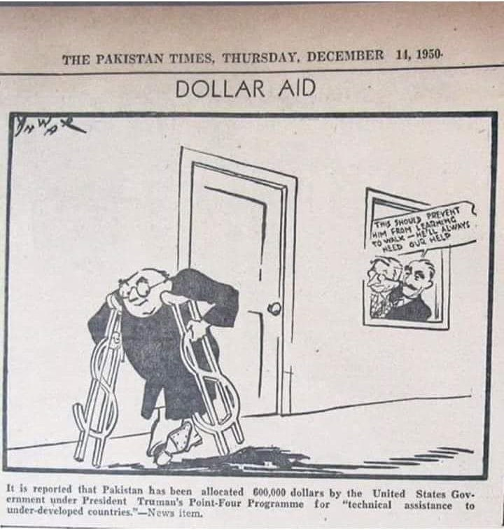
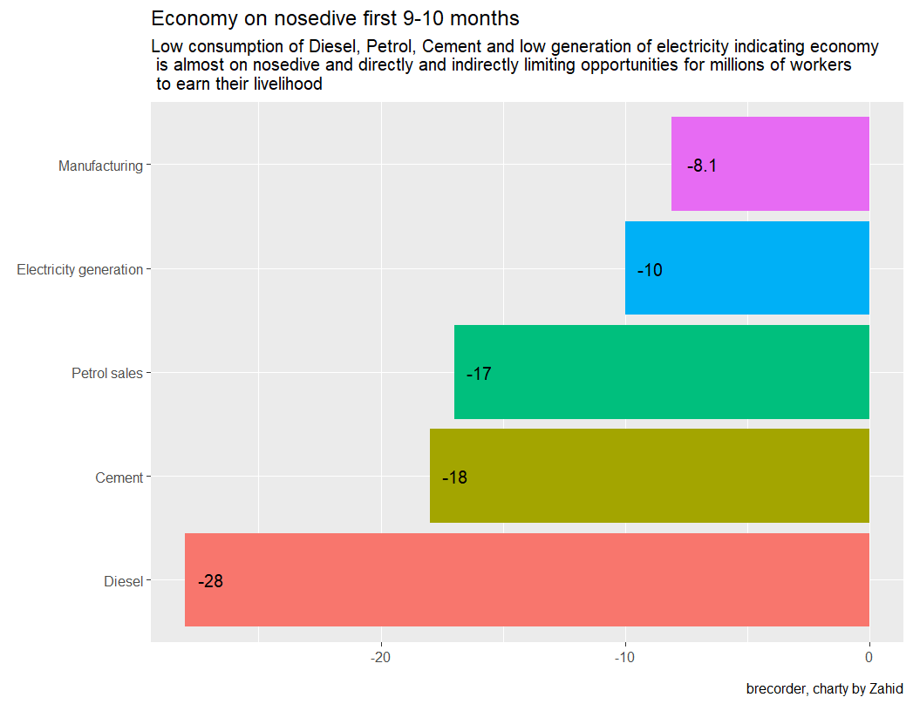
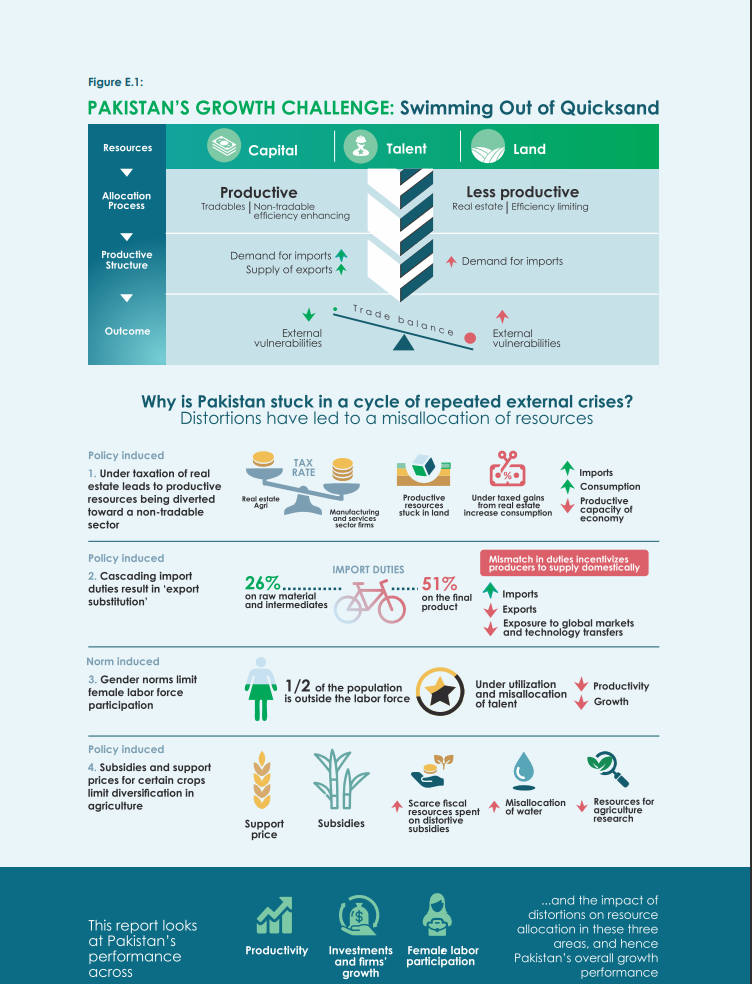
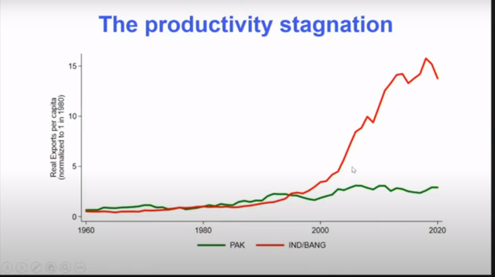
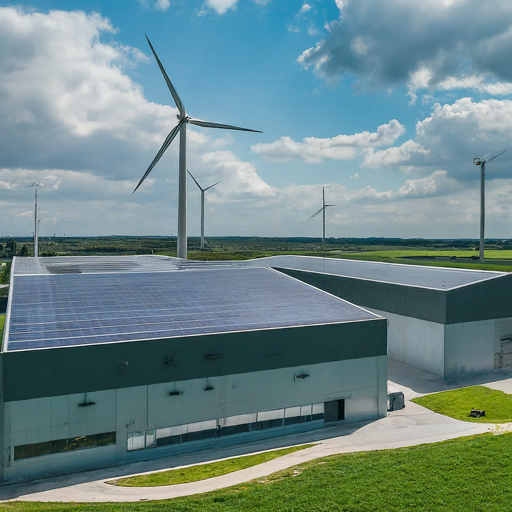

# Part I {.section-divider background-color="#0a1f12"}

::: r-fit-text
[The Boom-Bust Trap]{.gold}
:::

## Atlas of Economic Complexity

::::: columns
::: {.column width="50%"}
{fig-align="center" width="100%"}

[atlas.hks.harvard.edu/countries/586](https://atlas.hks.harvard.edu/countries/586/){.text-muted}
:::

::: {.column width="50%"}
### Pakistan's complexity ranking

-   Economic Complexity Index (ECI) rank: **\~99th** globally
-   Declined **20 places** in a decade
-   Vietnam (+11), India (+8), Thailand (+9) all improved
-   Pakistan added 21 new products since 2003 — contributing only **\$2 per capita**
-   Vietnam added 48 new products — contributing **\$1,020 per capita**
:::
:::::

## The Recurring Crisis Pattern

::: callout-warning
## 25 IMF programs since 1950

Each stabilisation restores short-run metrics without addressing structural drivers. The cycle is almost certain to repeat.

[Reference: [Getting Out of the Economic Boom-Bust Cycle](https://www.brecorder.com/news/40355109/getting-out-of-the-economic-boom-bust-cycle) — Business Recorder]{.text-muted}
:::

## The Anatomy of a Boom-Bust Cycle

::: incremental
1.  **Import-driven boom** — consumption grows, imports surge, GDP rises
2.  **Balance of payments crisis** — current account deficit becomes unsustainable
3.  **IMF bailout** — austerity, devaluation, demand compression
4.  **Brief stabilisation** — inflation falls, reserves rebuild
5.  **Short period of growth** — government claims victory
6.  **Crisis returns** — structural issues untouched, cycle repeats
:::

::: fragment
> *"Large trade deficits and even surpluses do not mean something good. Pakistan has gone through this many times before. This time is no different."*
:::

## Consumption-Led Growth: The Structural Problem

::::: columns
::: {.column width="50%"}
{fig-align="center" width="95%"}
:::

::: {.column width="50%"}
-   Growth driven by **domestic consumption**, not investment or exports
-   Focus on **light industries** — quick profits, low value addition
-   **Heavy industries** remain underdeveloped
-   No transition to **investment-** or **export-led** model
-   Remittances (\~9.4% of GDP) fund consumption, not productive investment
:::
:::::

## How the Cycle Self-Perpetuates

:::::: columns
::: {.column width="50%"}
{fig-align="center" width="95%"}

[GDP composition: consumption dominance]{.text-muted .center}
:::

:::: {.column width="50%"}
::: incremental
-   As **growth ↑** → imports ↑ → CAD ↑
-   CAD pressure forces exchange rate depreciation
-   Depreciation raises import costs → inflation
-   Central bank raises rates → economy contracts
-   Stabilisation at **lower growth**
-   Cycle begins again
:::
::::
::::::

## Light vs Heavy Industry: The Missing Transition

::::: columns
::: {.column width="50%"}
### Pakistan — stuck in light industry

-   **Textiles & garments:** \~60% of exports
-   **Sports goods (Sialkot):** limited innovation
-   **Leather products:** basic processing
-   **Heavy industry:** steel, auto, chemicals — all underdeveloped
-   Investment + skilled labour gravitates to quick-return light sectors
:::

::: {.column width="50%"}
### What successful countries did

| Country        | Strategy                             | Result             |
|----------------|--------------------------------------|--------------------|
| **S. Korea**   | Heavy industry push (POSCO, Hyundai) | Consistent growth  |
| **China**      | Balanced + state investment          | World's factory    |
| **Vietnam**    | GVC integration via FDI              | Exports 87% of GDP |
| **Bangladesh** | RMG + female workforce               | \$55B exports      |
:::
:::::

## The Core Insight

::: callout-important
## Industrial policy is necessary

Manufacturing-led structural transformation requires **deliberate industrial policy**.

It does not emerge from market forces alone — particularly in a distorted economy like Pakistan's.
:::

## Price-Wage Spiral & Structural Disequilibrium

::::: columns
::: {.column width="50%"}
### Light industries: price-wage spiral

-   Investment → rapid growth → labour demand rises
-   Workers demand higher wages
-   Higher wages → higher production costs → firms raise prices
-   Cycle: **wages ↑ → prices ↑ → wages ↑**
-   Result: persistent inflation **without** productivity gains
:::

::: {.column width="50%"}
### Heavy industries: low elasticity

-   Large capital, long gestation
-   Demand rises → supply lags → **overinvestment**
-   Demand falls → supply persists → **losses, shutdowns**
-   This **lag in adjustment** creates the boom-bust dynamic
:::
:::::

::: fragment
**Combined effect:** systemic instability that targeted policy — not blanket austerity — must address.
:::

## The Critique of Neoliberal Prescriptions

::: incremental
-   **Austerity** suppresses demand without fixing supply constraints
-   **Twin deficit focus** treats symptoms, not the disease
-   **Market fundamentalism** assumes price signals alone drive development
-   **Import liberalisation** without first building export capacity
-   25 IMF programs — **same prescriptions, same outcomes**
:::

::: {.fragment .callout-warning}
*"Addressing symptoms will not cure the disease."*
:::

## What History Actually Shows

::: incremental
-   **No country** has industrialised through austerity alone
-   East Asian tigers (Japan, Korea, Taiwan) used **active industrial policy**
-   China's dual-track pricing in the 1980s — balanced liberalisation with state guidance
-   Even World Bank research now acknowledges the limits of the Washington Consensus
-   **Productivity** — not fiscal balance — is the ultimate determinant of prosperity
:::

## Productivity Stagnation: The Root Cause

::::: columns
::: {.column width="50%"}
{fig-align="center" width="95%"}

[World Bank Pakistan Development Update]{.text-muted .center}
:::

::: {.column width="50%"}
{fig-align="center" width="95%"}

[Productivity stagnation vs. peers]{.text-muted .center}
:::
:::::

## Key Productivity Findings

::: incremental
-   Yield growth driven by **intensive input use**, not efficiency gains
-   **Allocative efficiency:** only 18% from better resource allocation, 12% from new firm entry
-   **Export side:** Duty Drawback had little impact and high cost/benefit ratio
-   **Import side:** duties rose **15% (FY10) → 21.3% (FY20)** → higher cost of intermediaries and capital equipment
:::

::: fragment
> *"Productivity is key in all economic sectors from the point of view of employment, poverty reduction and export orientation."* — World Bank
:::

# Part II {.section-divider background-color="#0a1f12"}

::: r-fit-text
[Regional Comparisons]{.gold}
:::

## Pakistan in 1960 vs Today

::: callout-warning
## A historic decline

In the **1960s**, Pakistan was **23–24% richer** in GDP per capita than the average of China, India, Bangladesh, Indonesia, and Malaysia.

Today it has **fallen behind all of them.**
:::

## The Decline in Relative Position

| Decade | Pakistan vs. Peer Average |
|--------|:-------------------------:|
| 1960s  |     **+23–24%** above     |
| 1970s  |           +18%            |
| 1980s  |            +7%            |
| 1990s  |      **−34%** below       |
| 2000s  |           −20%            |
| 2020s  | **Bottom of peer group**  |

::: fragment
**What changed?** Others industrialised. Pakistan didn't.
:::

## The Long View {.center}

{fig-align="center" width="62%"}

[Exports of goods & services (% GDP) — Pakistan vs Vietnam, Bangladesh, India]{.text-muted .center}

[Source: Our World in Data / World Bank WDI · [interactive view](https://ourworldindata.org/grapher/exports-of-goods-and-services-as-a-share-of-gdp?tab=line&time=2000..latest&country=PAK~VNM~BGD~IND~MYS)]{.text-muted .center .smaller}

## The Bangladesh Paradox

{fig-align="center" width="55%"}

[GDP per capita (PPP) — Pakistan vs Bangladesh vs Vietnam vs India]{.text-muted .center}

[[Interactive view at Our World in Data](https://ourworldindata.org/grapher/gdp-per-capita-worldbank?tab=line&time=2000..latest&country=PAK~BGD~VNM~IND)]{.text-muted .center .smaller}

## What Bangladesh Got Right

::: incremental
-   Garment exports grew from **\$6B → \$55B** (2000–2024)
-   Kept export tax rates **low and competitive**
-   Built a **large trained female workforce** for manufacturing
-   Garment sector upgraded from basic to **mid-value** products
-   Maintained macro stability **without IMF** for over a decade
-   Per-capita income now **higher** than Pakistan (PPP-adjusted)
:::

## What Pakistan Got Wrong

::: incremental
-   Merchandise exports: **\$9B → \~\$32B** over the same period
-   **Raised** tax rates on exporters — highest effective rate in the region
-   Female LFPR: **\~24%** — massive productive capacity untapped
-   Garment sector **stagnating** at the low-value end
-   **25 IMF programs** — chronic dependence
-   Anti-export bias entrenched in tariff structure
:::

::: {.fragment .callout-important}
The lesson is not ideology — it is **execution**. Bangladesh didn't follow a textbook; it picked a sector, kept costs competitive, and stayed the course. Pakistan did the opposite.
:::

## The Vietnam Model

::::: columns
::: {.column width="50%"}
### Vietnam's success formula

-   Exports/GDP: **87%** — deliberate GVC integration
-   Attracted **Samsung, Intel, Nike** through competitive incentives
-   Low effective corporate tax for exporters
-   **Political stability and policy continuity**
-   Investment in **workforce skills**
-   Reliable infrastructure: power, logistics, ports
:::

::: {.column width="50%"}
### Preconditions Pakistan lacks

1.  ❌ Policy continuity (FM tenure \< 18 months)
2.  ❌ Competitive energy costs
3.  ❌ Reliable infrastructure
4.  ❌ Rule of law for foreign investors
5.  ❌ Low effective tax for export-FDI
6.  ❌ Functional SEZs
:::
:::::

::: {.fragment .callout-tip}
**What Pakistan could borrow:** Focus SEZs on genuinely export-oriented FDI with tax holidays, fast-track approvals, and dedicated infrastructure — not the current model of giving land to domestic developers with an "SEZ" label.
:::

## South Korea: The Institutional Comparison

::::: columns
::: {.column width="50%"}
### South Korea's path

-   Deliberate **heavy industry policy** (1960s–80s)
-   Government picked winners — **subsidies tied to export performance**
-   Invested **4.9% of GDP in R&D**
-   Built world-class universities → fed industrial pipeline
-   Result: high-value exports, diversified economy
:::

::: {.column width="50%"}
### Pakistan vs South Korea (2024)

| Indicator        |    PK     |     SK     |
|------------------|:---------:|:----------:|
| Exports/GDP      |    10%    |    43%     |
| R&D/GDP          |   0.2%    |  **4.9%**  |
| Industrial share | Declining |   Stable   |
| Value addition   |    Low    |    High    |
| Export diversity |  Narrow   |   Broad    |
| Boom-bust        |  Chronic  | Eliminated |
:::
:::::

::: fragment
> *South Korea's per-capita income was comparable to Pakistan's in the 1960s. Today it is an OECD member with per-capita income 15× higher.*
:::

# Part III {.section-divider background-color="#0a1f12"}

::: r-fit-text
[The Institutional Question]{.gold}
:::

## Extractive vs Inclusive Institutions

::: callout-important
## Why Nations Fail

Acemoglu & Robinson: nations fail when their institutions are **extractive** (serving elites) rather than **inclusive** (enabling broad-based participation).
:::

## Pakistan's Extractive Institutions

::: incremental
-   **Insecure property rights** — capital flows to non-productive assets
-   **Entry barriers** — regulations and rent-seeking create un-level playing field
-   **System designed by and for elites** — landed, military, commercial
-   **Weak contract enforcement** — deters long-horizon investment
-   **Policy capture** — industrial elites shape tariffs, subsidies, SROs
-   **Military's economic footprint** — assets grew from **\$30B → \$39.8B** (2016–2023)
:::

## What Inclusive Institutions Look Like

::: incremental
-   **Secure property rights** — including for small businesses
-   **Rule of law** — contracts are honoured
-   **Open markets** with state support
-   **Free entry** of new businesses
-   **Access to education** for the majority
-   **Meritocracy** — talent allocation by capability, not connections
:::

::: fragment
The gap is not about *knowing what to do*. The gap is about **incentive structures** that reward extraction over inclusion.
:::

## The Software Problem

::: callout-warning
## Hardware vs software

Pakistan's development discourse focuses on **hardware** — SEZs, roads, corridors, pipelines.

But what drives growth is **software** — institutions, rules, capabilities.
:::

## The Software Pakistan Needs

::: incremental
1.  **Rule of Law** — contracts honoured, disputes resolved efficiently
2.  **Property Rights** — China's takeoff began when these changed
3.  **Meritocracy** — talent allocation by capability
4.  **Organisational & Managerial Capacity** — firms that can compete globally
5.  **Knowledge Acquisition** — learning, adaptation, innovation
:::

::: {.fragment .callout-important}
None of this can be **bought or imported**. It must be built domestically through sustained reform.
:::

## The Hayek Insight

::: callout-tip
> *"It is, perhaps, worth stressing that economic problems arise always and only in consequences of change."* — F. A. Hayek, *The Use of Knowledge in Society*
:::

## Short-Termism: The Myopic Approach

::: incremental
-   Successive governments suffer from **myopia** — optimising for the next election
-   Occasional **consumption booms** from borrowing and remittances (2002–05, 2016–18)
-   Growing **informal economy** weakens state control and tax base
-   Pakistan remains "married to the begging bowl"
-   Sought FDI **without terms** — no technology transfer, no export conditions
-   **"Pipenomics"** — expecting others to build Pakistan's future
:::

## Why Governments Avoid Productivity

::: incremental
-   Building domestic capacity requires **hard work** and institution building
-   Hiring competent people means **ending nepotism**
-   Results take **years**, not election cycles
-   Easier to announce megaprojects than reform civil service
-   Easier to raise tariffs than broaden the tax base
-   Easier to blame the IMF than implement structural reform
:::

::: fragment
> *"Learning how to catch a fish is harder than asking someone for a fish — but it's the only way to eat every day."*
:::

# Part IV {.section-divider background-color="#0a1f12"}

::: r-fit-text
[The Reform Agenda]{.gold}
:::

## Government Initiatives Today {.center}

{fig-align="center" width="58%"}

[SEZs · renewable energy · infrastructure · technology adoption]{.text-muted .center}

## The Window of Opportunity (2025–2026)

::: callout-important
## A rare convergence

Functioning IMF program (37-month EFF) · improved geopolitical ties · falling inflation · rebuilt reserves (SBP: \$14.5B) · LSM growing at 5.75%.

**This window must be used for structural reform.**
:::

## Why This Window Will Close

::: incremental
-   **US tariffs** on Pakistan at 37% (April 2025) — export competitiveness under further pressure
-   **Global uncertainty** — tighter financial conditions, commodity volatility
-   **IMF program** has a finite horizon — reforms must happen *within* it
-   **Political cycle** — government's reform credibility limited by electoral pressures
-   **History:** every previous stabilisation was wasted
:::

::: {.fragment .callout-warning}
*The next crisis burst is not far if this window is wasted.*
:::

## The 2023 National Industrial Policy

::::: columns
::: {.column width="50%"}
### What was proposed

-   Vision of **export-led industrial development**
-   Target: **\$100B exports** within 5 years
-   Transition from import substitution to GVC integration
-   Address the four structural distortions

[Reference: [A Futuristic Industrial Policy](https://tribune.com.pk/story/2452503/a-futuristic-industrial-policy)]{.text-muted}
:::

::: {.column width="50%"}
### The reality check

-   FY25–26 merchandise exports: **\~\$32B** and falling
-   \$100B target requires **tripling** in 4 years
-   **No precedent** for this without massive reform
-   *"Less a strategy than a sandcastle without structural reform"*
:::
:::::

## What a Credible Policy Needs

::: incremental
1.  **Remove anti-export bias** — rationalise tariffs (National Tariff Policy FY25–30)
2.  **Competitive energy** — industrial tariffs at regional parity
3.  **Genuine SEZs** — export-oriented, not real estate schemes
4.  **Tax incentives for exporters** — lower effective rates, not higher
5.  **Female workforce mobilisation** — from 24% to 40%+ over a decade
6.  **R&D investment** — from 0.2% to at least 1% of GDP
7.  **Digital public infrastructure** — formalise the economy
:::

## Immediate Reforms (0–12 Months)

::: incremental
1.  [🔴]{.red} **Abolish super tax** on corporations — Pakistan's effective rate (39%+) is among the highest regionally
2.  [🔴]{.red} **Tax the untaxed** — agriculture (\>25 acres), large retail, real estate capital gains
3.  [🔴]{.red} **Reduce income tax** on salaried workers and exporters — current rates drive brain drain
4.  [🔴]{.red} **Implement National Fiscal Pact** (Sept 2024) — provinces fund their share
5.  [🔴]{.red} **Follow through on PIA privatisation** — essential for market signalling
:::

## Medium-Term Reforms (1–3 Years)

::: incremental
1.  [🟠]{.amber} **Energy sector overhaul** — circular debt, DISCO privatisation, IPP renegotiation
2.  [🟠]{.amber} **Export diversification** — surgical instruments, IT/ITeS, pharma, halal food, value-added textiles
3.  [🟠]{.amber} **Industrial policy reform** — time-bound, performance-conditional support
4.  [🟠]{.amber} **Female labour force participation** — 24% → 35%+
5.  [🟠]{.amber} **Reduce government size** — consolidate, digitise, eliminate ghost employees
:::

## Long-Term Investment (3–10 Years)

::: incremental
1.  [🔵]{.blue} **Human capital revolution** — reduce learning poverty, STEM and vocational training
2.  [🔵]{.blue} **Independent civil service and judiciary** — institutions that outlast governments
3.  [🔵]{.blue} **Climate resilience infrastructure** — flood defences, water pricing, clean energy
4.  [🔵]{.blue} **Digital public infrastructure** — formalise economy, broaden tax base
5.  [🔵]{.blue} **R&D ecosystem** — from 0.2% to 1%+ of GDP
:::

## The World Bank's Four Recommendations

::: callout-important
## "Reviving Pakistan's Exports"

[Reference: [Raising Pakistan's Exports — The Way Forward](https://dissenttoday.net/featured/raising-pakistans-exports-the-way-forward/)]{.text-muted}
:::

::: incremental
1.  **Gradually reduce effective protection** through long-term tariff rationalisation
2.  **Reallocate export financing** to capacity expansion via Long-Term Financing Facility
3.  **Consolidate market intelligence** — support new exporters, evaluate interventions
4.  **Long-term productivity strategy** — competition, innovation, export potential
:::

## The Recurring Pattern

::: callout-warning
## Why nothing changes

Administration after administration applies the same standard instruments **without empirical evaluation** of their effectiveness — partly because the same faces head ministries from one government to another.

The **most influential industries survive**, while the economy stagnates.
:::

## Getting the Basics Right

::::: columns
::: {.column width="50%"}
### What people wish for

-   High revenue
-   High exports
-   High growth
-   Stable exchange rate
-   Low inflation

*"Economy is not rocket science!"*

But **wishing** for all good things is not economics.
:::

::: {.column width="50%"}
### What actually matters

1.  Securing property rights
2.  Strengthening contracting
3.  Reducing transaction costs
4.  Removing rent-seeking incentives
5.  Good governance

> *Without good governance, plan after plan will fail — as they always have.*
:::
:::::

## The Hayek–Sen–Lucas Framework

::: incremental
-   **Hayek:** freedom, knowledge sharing, reduced transaction costs
-   **Lucas (1988):** *"Once you start thinking about growth of nations, it is hard to think about anything else."*
-   **Sen:** development as **freedom** — capabilities, choices, productivity
:::

::: fragment
The journey is hard and long-term. **There are no shortcuts.**
:::

## Production Over Commerce

::: callout-tip
## The fundamental orientation

-   **Production** over commerce
-   **Domestic capacity** over external dependency
-   **Software** over hardware
-   **Long game** over electoral myopia
-   **Inclusive institutions** over extractive ones
:::

#  {.section-divider background-color="#112e1e"}

::: r-fit-text
[The Bottom Line]{.gold}
:::

## Cyclical, Not Structural

::: callout-warning
Pakistan's current "achievements" — falling inflation, primary surplus, rebuilt reserves — are largely **cyclical, not structural**.

They reflect demand destruction, import compression, and the passing of the global commodity shock — **not** a genuine transformation.
:::

## A Rare Inflection Point

The country stands at a rare inflection point: a functioning IMF programme, improved geopolitical ties, and a brief window of financial calm.

::: fragment
**This window must be used to:**
:::

::: incremental
-   Broaden the tax base and stop crushing the formal economy
-   Resolve the energy crisis that makes manufacturing uncompetitive
-   Build genuine export competitiveness — not with slogans, but with structural reform
-   Invest seriously in human capital — the only sustainable growth driver
:::

## Without Reform, the Cycle Returns

::: callout-important
The next bust is a question of ***when***, not ***whether***.
:::

::: fragment
> *"All of us have to come out of our comfort zone and encourage discussion and debate."*
:::

##  {background-color="#0a1f12"}

:::: center
::: r-fit-text
[Thank You]{.gold}
:::

[Prof. Dr. Zahid Asghar]{.large}

[School of Economics · Quaid-i-Azam University · Islamabad]{.text-muted}

[Spring 2026]{.text-muted}
::::